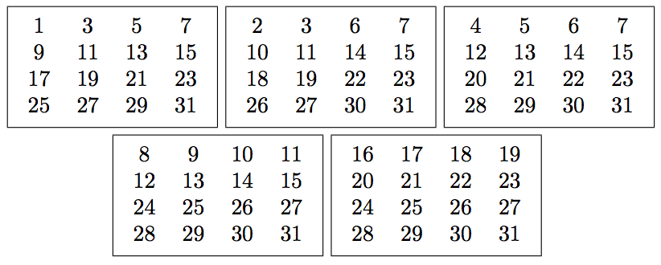

==============================
Mercredi - Projets par groupes
==============================

Liste des projets
:::::::::::::::::

- `Pliage de papier et courbe du dragon`_ (2 personnes)
- `Cartes magiques`_ (2 personnes)
- `Cryptographie`_ (7 personnes)

Pliage de papier et courbe du dragon
::::::::::::::::::::::::::::::::::::

    Si l'on prend une bande de papier que l'on plie en deux, toujours dans le même sens (à gauche par exemple), la forme résultante présente une suite de changements de direction que l'on peut coder par G pour gauche et D pour droite.

Source : `Wikipédia <http://fr.wikipedia.org/wiki/Suite_de_pliage_de_papier>`_

Le but était de dessiner une telle courbe, en fonction du nombre de plis.

Le code, par Uzma et Hadjira
----------------------------

Vous pouvez changer la valeur de ``numero`` et relancer le traçage de la courbe.

.. activecode:: pliage

    numero = 7

    def inverse(chemin):
        chemin_inverse = ""
        for i in range (len(chemin)):
            if chemin[i] == "g":
                chemin_inverse += "d"
            elif chemin[i] == "d":
                chemin_inverse += "g"
        return chemin_inverse[::-1]

    def suivant(chemin):
        chemin_suivant = ""
        chemin_suivant = chemin + "d" + inverse(chemin)
        return chemin_suivant

    def dragon(numero):
        global taille
        taille = 75 // numero
        chemin = ""
        for i in range(numero):
            chemin = suivant(chemin)
        return chemin

    import turtle
    tortue = turtle.Turtle()
    tortue.speed(10)

    def debut():
        gauche()

    def gauche():
        tortue.left(90)
        tortue.forward(taille)
        
    def droite():
        tortue.right(90)
        tortue.forward(taille)

    def dessin(chemin):
        debut()
        for direction in chemin:
            if direction == "d":
                droite()
            else:
                gauche()

    dessin(dragon(numero))

La courbe obtenue s'appelle `courbe du dragon <https://fr.wikipedia.org/wiki/Courbe_du_dragon>`_ et de nombreuses propriétés mathématiques à son sujet ont été découvertes, notamment par `Donald Knuth <https://fr.wikipedia.org/wiki/Donald_Knuth>`_.

Cartes magiques
:::::::::::::::

    Pense à un nombre entre 0 et 31, dis-moi sur lesquelles de ces cartes il se trouve, et je devinerai lequel c'est.

Le but était de comprendre le tour de magie et de reconstruire un tel jeu de cartes.

Le code, par Minaine et Fouleymata
----------------------------------

Vous pouvez changer la valeur de ``nb_cartes`` et relancer l'exécution.

.. activecode:: cartes

    nb_cartes = 5

    def binaire(n):
        S = ""
        while n > 0:
            if n % 2 == 0:
                S = "0" + S
                n = n // 2
            else:
                S = "1" + S
                n = n // 2
        return S

    cartes = [[] for _ in range(nb_cartes)]
    nb_max = 2 ** nb_cartes
    for nombre in range(nb_max):
        chaine = binaire(nombre)
        for b in range(nb_cartes):
            if len(chaine) >= b + 1 and chaine[-(b + 1)] == '1':
                cartes[b].append(nombre)
    for carte in cartes:
        print(carte)

Cryptographie
:::::::::::::

Les activités proposées :

- Coder des fonctions de chiffrement et déchiffrement du `César <http://fr.wikipedia.org/wiki/Chiffrement_par_décalage>`_
- Attaque du chiffrement César par `force brute <http://fr.wikipedia.org/wiki/Chiffrement_par_décalage#Attaques>`_
- Coder des fonctions de chiffrement et déchiffrement du `Vigenère <http://fr.wikipedia.org/wiki/Chiffre_de_Vigenère>`_
- Coder une fonction de chiffrement par `substitution quelconque <http://fr.wikipedia.org/wiki/Chiffrement_par_substitution>`_
- Attaque d'une substitution quelconque par `analyse fréquentielle <http://fr.wikipedia.org/wiki/Analyse_fréquentielle>`_
