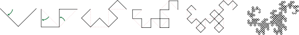

==============================
Mercredi - Projets par groupes
==============================

Liste des projets
:::::::::::::::::

- `Pliage de papier et courbe du dragon`_ (2 personnes)
- `Cartes magiques`_ (2 personnes)
- `Cryptographie`_ (7 personnes)

Pliage de papier et courbe du dragon
::::::::::::::::::::::::::::::::::::

    Si l'on prend une bande de papier que l'on plie en deux, toujours dans le même sens (à gauche par exemple), la forme résultante présente une suite de changements de direction que l'on peut coder par G pour gauche et D pour droite.

Source : `Wikipédia <http://fr.wikipedia.org/wiki/Suite_de_pliage_de_papier>`_

Le but était de dessiner une telle courbe, en fonction du nombre de plis.

Le code, par Uzma et Hadjira
----------------------------

Vous pouvez changer la valeur de ``numero`` et relancer le traçage de la courbe.

.. activecode:: pliage

    numero = 7

    def inverse(chemin):
        chemin_inverse = ""
        for i in range (len(chemin)):
            if chemin[i] == "g":
                chemin_inverse += "d"
            elif chemin[i] == "d":
                chemin_inverse += "g"
        return chemin_inverse[::-1]

    def suivant(chemin):
        chemin_suivant = ""
        chemin_suivant = chemin + "d" + inverse(chemin)
        return chemin_suivant

    def dragon(numero):
        global taille
        taille = 75 // numero
        chemin = ""
        for i in range(numero):
            chemin = suivant(chemin)
        return chemin

    import turtle
    tortue = turtle.Turtle()
    tortue.speed(10)

    def debut():
        gauche()

    def gauche():
        tortue.left(90)
        tortue.forward(taille)
        
    def droite():
        tortue.right(90)
        tortue.forward(taille)

    def dessin(chemin):
        debut()
        for direction in chemin:
            if direction == "d":
                droite()
            else:
                gauche()

    dessin(dragon(numero))

La courbe obtenue s'appelle `courbe du dragon <https://fr.wikipedia.org/wiki/Courbe_du_dragon>`_ et de nombreuses propriétés mathématiques à son sujet ont été découvertes, notamment par `Donald Knuth <https://fr.wikipedia.org/wiki/Donald_Knuth>`_.

Cartes magiques
:::::::::::::::

    Pense à un nombre entre 0 et 31, dis-moi sur lesquelles de ces cartes il se trouve, et je devinerai lequel c'est.

.. image:: ../_static/magie.png
    :align: center

Le but était de comprendre le tour de magie et de reconstruire un tel jeu de cartes.

Le code, par Minaine et Fouleymata
----------------------------------

Vous pouvez changer la valeur de ``nb_cartes`` et relancer l'exécution.

.. activecode:: cartes

    nb_cartes = 5

    def binaire(n):
        S = ""
        while n > 0:
            if n % 2 == 0:
                S = "0" + S
                n = n // 2
            else:
                S = "1" + S
                n = n // 2
        return S

    cartes = [[] for _ in range(nb_cartes)]
    nb_max = 2 ** nb_cartes
    for nombre in range(nb_max):
        chaine = binaire(nombre)
        for b in range(nb_cartes):
            if len(chaine) >= b + 1 and chaine[-(b + 1)] == '1':
                cartes[b].append(nombre)
    for carte in cartes:
        print(carte)

Cryptographie
:::::::::::::

Les activités proposées :

- `Chiffrement et déchiffrement du `César <http://fr.wikipedia.org/wiki/Chiffrement_par_décalage>`_`_
- `Chiffrement et déchiffrement du César`_
- Coder des fonctions de chiffrement et déchiffrement du `César <http://fr.wikipedia.org/wiki/Chiffrement_par_décalage>`_
- Attaque du chiffrement César par `force brute <http://fr.wikipedia.org/wiki/Chiffrement_par_décalage#Attaques>`_
- Coder des fonctions de chiffrement et déchiffrement du `Vigenère <http://fr.wikipedia.org/wiki/Chiffre_de_Vigenère>`_
- Coder une fonction de chiffrement par `substitution quelconque <http://fr.wikipedia.org/wiki/Chiffrement_par_substitution>`_
- Attaque d'une substitution quelconque par `analyse fréquentielle <http://fr.wikipedia.org/wiki/Analyse_fréquentielle>`_

Chiffrement et déchiffrement du `César <http://fr.wikipedia.org/wiki/Chiffrement_par_décalage>`_
------------------------------------------------------------------------------------------------

On décale toutes les lettres d'un certain nombre de lettres, ici la valeur de la variable ``decalage``. Par exemple, lorsque ``decalage`` vaut 4, ``A`` devient ``E``, ``B`` devient ``F``, ``P`` devient ``T``, etc.

.. activecode:: cesar

    def main():
        print(chiffrer_cesar("PROLOGIN C'EST COOL", 4))  # TVSPSKMRGIWXGSSP
        print(dechiffrer_cesar("TVSPSKMRGIWXGSSP", 4))  # PROLOGINCESTCOOL

    def decaler(lettre, decalage):
        alphabet = "ABCDEFGHIJKLMNOPQRSTUVWXYZ"
        # Détermine la position de la lettre dans l'alphabet : A = 0, B = 1, etc.
        position = ord(lettre) - ord("A")
        if position >= 0 and position < 26:  # Si la lettre est dans l'alphabet
            lettre_chiffree = alphabet[(position + decalage) % 26]  # % 26 car Z + 1 = A
        else:
            lettre_chiffree = ""  # Tout autre caractère est ignoré
        return lettre_chiffree

    def chiffrer_cesar(chaine, decalage):
        chaine_chiffree = ""
        for lettre in chaine:
            lettre_chiffree = decaler(lettre, decalage)
            # On ajoute à la chaîne la lettre chiffrée
            chaine_chiffree += lettre_chiffree
        return chaine_chiffree

    def dechiffrer_cesar(chaine_chiffree, decalage):
        # Décaler de N lettres vers la gauche équivaut à décaler de 26 - N lettres vers la droite
        return chiffrer_cesar(chaine_chiffree, 26 - decalage)

    main()

Attaque du chiffrement César par `force brute <http://fr.wikipedia.org/wiki/Chiffrement_par_décalage#Attaques>`_
----------------------------------------------------------------------------------------------------------------

Il suffit de tester toutes les possibilités de décalage, de ``0`` à ``25``.

.. code-block:: python

    message = "HJGDGYAFUWKLUGGD"
    for decalage in range(26):  # decalage parcourt tous les entiers de 0 à 25
        print(chiffrer_cesar(message, decalage))

Le résultat obtenu permet de repérer le message. ::

    HJGDGYAFUWKLUGGD
    IKHEHZBGVXLMVHHE
    JLIFIACHWYMNWIIF
    KMJGJBDIXZNOXJJG
    LNKHKCEJYAOPYKKH
    MOLILDFKZBPQZLLI
    NPMJMEGLACQRAMMJ
    OQNKNFHMBDRSBNNK
    PROLOGINCESTCOOL ← Hey, Prologin c'est cool !
    QSPMPHJODFTUDPPM
    RTQNQIKPEGUVEQQN
    SURORJLQFHVWFRRO
    TVSPSKMRGIWXGSSP
    UWTQTLNSHJXYHTTQ
    VXURUMOTIKYZIUUR
    WYVSVNPUJLZAJVVS
    XZWTWOQVKMABKWWT
    YAXUXPRWLNBCLXXU
    ZBYVYQSXMOCDMYYV
    ACZWZRTYNPDENZZW
    BDAXASUZOQEFOAAX
    CEBYBTVAPRFGPBBY
    DFCZCUWBQSGHQCCZ
    EGDADVXCRTHIRDDA
    FHEBEWYDSUIJSEEB
    GIFCFXZETVJKTFFC

Ce n'est donc pas un système de chiffrement sûr. Ne refaites pas ça à la maison.

Chiffrement et déchiffrement du `Vigenère <http://fr.wikipedia.org/wiki/Chiffre_de_Vigenère>`_
----------------------------------------------------------------------------------------------

.. activecode:: vigenere

    def main():
        print(chiffrer_vigenere("PROLOGIN C'EST COOL", "PIKA"))  # EZYLDOSNRMCTRWYL
        print(dechiffrer_vigenere("EZYLDOSNRMCTRWYL", "PIKA"))  # PROLOGINCESTCOOL

    def decaler(lettre, decalage):
        alphabet = "ABCDEFGHIJKLMNOPQRSTUVWXYZ"
        # Détermine la position de la lettre dans l'alphabet : A = 0, B = 1, etc.
        position = ord(lettre) - ord("A")
        if position >= 0 and position < 26:  # Si la lettre est dans l'alphabet
            lettre_chiffree = alphabet[(position + decalage) % 26]  # % 26 car Z + 1 = A
        else:
            lettre_chiffree = ""  # Tout autre caractère est ignoré
        return lettre_chiffree

    def chiffrer_vigenere(chaine, cle):
        n = len(chaine)
        k = len(cle)
        chaine_chiffree = ""
        masque = cle * (int(n / k) + 1)  # La clé est répétée pour atteindre la longueur de la chaîne
        position_masque = 0
        for i in range(n):
            lettre = chaine[i]
            lettre_cle = masque[position_masque]
            decalage = ord(lettre_cle) - ord("A")
            lettre_chiffree = decaler(lettre, decalage)
            if lettre_chiffree != "":
                position_masque += 1  # On n'avance dans le masque que si la lettre a été chiffrée
            chaine_chiffree += lettre_chiffree
        return chaine_chiffree

    def dechiffrer_vigenere(chaine, cle):
        n = len(chaine)
        k = len(cle)
        chaine_dechiffree = ""
        masque = cle * (int(n / k) + 1)
        for i in range(n):
            lettre = chaine[i]
            lettre_cle = masque[i]
            decalage = ord(lettre_cle) - ord("A")
            lettre_dechiffree = decaler(lettre, 26 - decalage)  # La seule ligne qui change (outre noms de variable)
            chaine_dechiffree += lettre_dechiffree
        return chaine_dechiffree

    main()

Chiffrement par `substitution quelconque <http://fr.wikipedia.org/wiki/Chiffrement_par_substitution>`_
------------------------------------------------------------------------------------------------------

.. activecode:: substitution

    def main():
        print(chiffrer("PROLOGIN C'EST COOL", "LDSQAONUKTIHRCGVBYEWXZFJPM"))
        print(chiffrer("PROLOGIN C'EST COOL MAIS IL VAUT MIEUX QUE JE METTE PLUSIEURS MOTS DE LA LANGUE FRANÇAISE DANS LA PHRASE SINON L'ANALYSE FREQUENTIELLE VA ECHOUER", "LDSQAONUKTIHRCGVBYEWXZFJPM"))
        print(dechiffrer("VYGHGNKCSAEWSGGH", "LDSQAONUKTIHRCGVBYEWXZFJPM"))

    def est_correcte(substitution):
        if sorted(substitution) == list("ABCDEFGHIJKLMNOPQRSTUVWXYZ"):
            print("Substitution OK")
            return True
        else:
            print("La substitution est incorrecte.")
            return False

    def chiffrer(chaine, substitution):
        if est_correcte(substitution):
            chaine_chiffree = ""
            for lettre in chaine:
                position = ord(lettre) - ord("A")
                if position >= 0 and position < 26:
                    chaine_chiffree += substitution[position]
            return chaine_chiffree

    def dechiffrer(chaine, substitution):
        if est_correcte(substitution):
            substitution_inverse = [""] * 26
            for i in range(26):
                position_arrivee = ord(substitution[i]) - ord("A")
                substitution_inverse[position_arrivee] = chr(ord("A") + i)
            chaine_dechiffree = ""
            for lettre in chaine:
                position = ord(lettre) - ord("A")
                if position >= 0 and position < 26:
                    chaine_dechiffree += substitution_inverse[position]  # Seule cette ligne change
            return chaine_dechiffree

    main()

Attaque d'une substitution quelconque par `analyse fréquentielle <http://fr.wikipedia.org/wiki/Analyse_fréquentielle>`_
-----------------------------------------------------------------------------------------------------------------------

